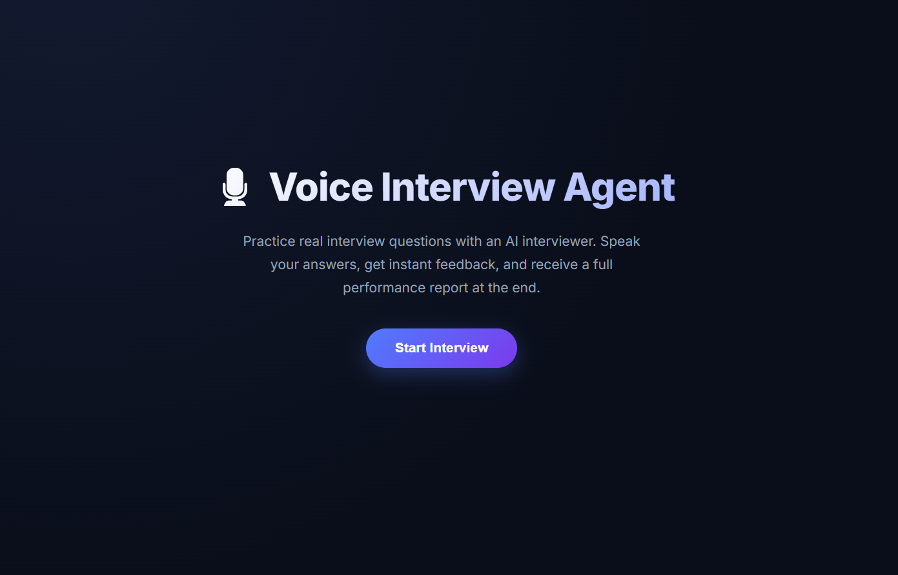
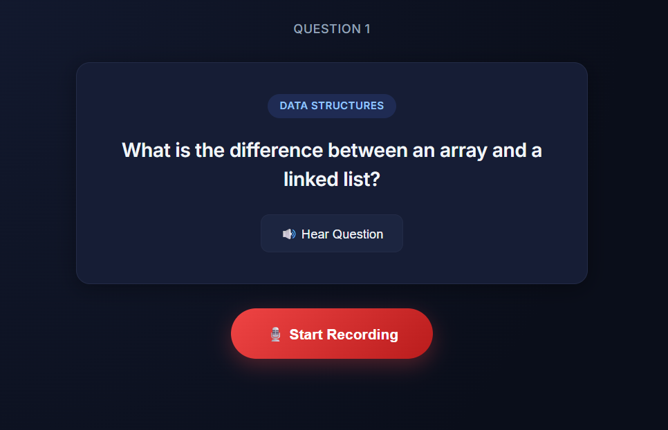
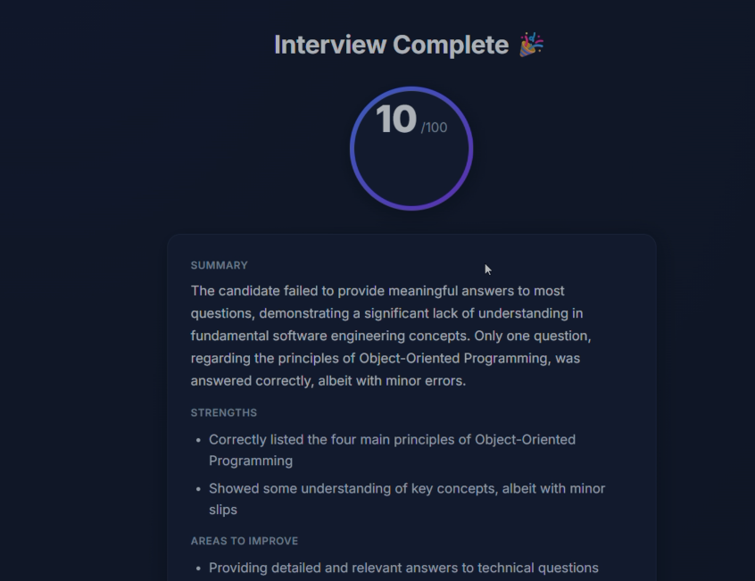

# 🎙 Voice Interview Agent

> AI-powered Voice Interview Practice Platform built using **ASP.NET Core (.NET 8)**, **Groq LLM**, **Whisper Speech-to-Text**, and **ElevenLabs Text-to-Speech**.

---

## 📌 Project Overview

The Voice Interview Agent is an AI-powered mock interview system that simulates a real technical interview through voice interaction.

The candidate answers interview questions using speech, which is converted into text using Whisper Speech-to-Text. The answer is evaluated by the Groq Large Language Model against a reference Question & Answer dataset. Based on the evaluation, the interviewer either asks a follow-up question (if the answer is weak or incomplete) or proceeds to the next interview question.

At the end of the interview, the system generates structured feedback including technical accuracy, completeness, clarity, strengths, areas of improvement, and an overall score.

This project was developed as part of a technical assessment to demonstrate backend engineering, AI integration, REST API development, and conversational AI system design.

---

# 🎥 Demo Video

Watch the complete demo here:

https://www.loom.com/share/0ea0e4c1e0e64e1da03a627dc0f996cc

---

# 📸 Screenshots

## 🏠 Landing Page



---

## 🎤 Interview Page



---

## 📊 Results Page



---

# ✨ Features

- 🎤 Voice-based interview experience
- 📝 Speech-to-Text using Whisper
- 🤖 AI-powered interviewer using Groq LLM
- 💬 Intelligent follow-up questions
- 🔊 Text-to-Speech using ElevenLabs
- 📊 Structured interview feedback
- 🌍 Multi-language support (English, Hindi, German)
- 📂 JSON-based interview dataset
- 🔄 Session management
- 📈 Per-question evaluation

---

# ⚙️ Tech Stack

## Backend

- ASP.NET Core (.NET 8)
- C#
- REST API
- Dependency Injection

### Frontend

- HTML
- CSS
- JavaScript

### AI Services

- Groq LLM
- Whisper Speech-to-Text
- ElevenLabs Text-to-Speech

---

# 🏗️ System Architecture

```text
                     Candidate
                         │
                         ▼
         HTML / CSS / JavaScript Frontend
                         │
                  REST API Requests
                         │
                         ▼
               InterviewController
                         │
                         ▼
               InterviewService
                         │
        ┌────────────────┼────────────────┐
        │                │                │
        ▼                ▼                ▼
   JSON Dataset     Session Store     AI Services
                                         │
                 ┌───────────────────────┼───────────────────────┐
                 ▼                       ▼                       ▼
          Whisper STT              Groq LLM              ElevenLabs TTS
                 │                       │                       │
                 └───────────────► Evaluation ◄─────────────────┘
                                        │
                                        ▼
                               Structured Feedback
                                        │
                                        ▼
                                   Frontend UI
```

---

# 🔄 Application Workflow

```text
Candidate Starts Interview
            │
            ▼
Select Role & Language
            │
            ▼
AI Asks Question
            │
            ▼
Candidate Speaks
            │
            ▼
Whisper Converts Speech → Text
            │
            ▼
Groq Evaluates Answer
            │
     ┌──────┴────────┐
     │               │
Strong Answer?      Weak Answer?
     │               │
     ▼               ▼
Next Question   Follow-up Question
     │               │
     └───────Repeat──┘
            │
            ▼
Generate Final Feedback
            │
            ▼
Display Results
```

---

# 📡 REST API Endpoints

| Method | Endpoint | Description |
|--------|----------|-------------|
| POST | `/api/Interview/start` | Starts a new interview session |
| POST | `/api/Interview/answer` | Evaluates a candidate's text answer |
| GET | `/api/Interview/questions/{role}` | Retrieves interview questions |
| POST | `/api/Interview/transcribe` | Converts speech into text |
| POST | `/api/Interview/speak` | Converts text into speech |
| POST | `/api/Interview/voice-answer` | Complete voice interview pipeline |

---

# 📂 Project Structure

```text
Voice-Interview-Agent
│
├── Backend
│   ├── Controllers
│   ├── DTOs
│   ├── Interfaces
│   ├── Services
│   ├── Data
│   │   └── Datasets
│   ├── Program.cs
│   └── appsettings.json
│
├── frontend
│   ├── index.html
│   ├── setup.html
│   ├── interview.html
│   ├── results.html
│   ├── css
│   └── js
│
├── images
│   ├── landing-page.png
│   ├── interview-page.png
│   └── results-page.png
│
├── .gitignore
└── Voice-Interview-Agent.sln
```

---

# 📄 Reference Dataset

Interview questions and ideal reference answers are stored in JSON files located at:

```text
Backend/Data/Datasets/
```

The dataset is independent of the application logic, making it easy to add, remove, or modify interview questions without changing the backend code.

---

# 🚀 How to Run

## Prerequisites

- Visual Studio 2022
- .NET 8 SDK
- Live Server (VS Code)
- Groq API Key
- ElevenLabs API Key
- Whisper API Access

---

## Backend

1. Clone the repository.
2. Open `Voice-Interview-Agent.sln` in Visual Studio.
3. Configure API keys using User Secrets.
4. Build the solution.
5. Run the ASP.NET Core backend.

Swagger API:

```
https://localhost:7186/swagger/index.html
```

---

## Frontend

Run the frontend using VS Code Live Server.

Default URL:

```
http://127.0.0.1:5500/frontend/interview.html
```

---

# 🧠 Engineering Decisions

- Used Dependency Injection for loose coupling and easier maintenance.
- Built REST APIs to separate frontend and backend.
- Stored interview questions in JSON so they can be updated without changing business logic.
- Maintained interview state using session management.
- Grounded the LLM with reference answers for consistent evaluation.
- Used follow-up questions to simulate a realistic interviewer instead of immediately revealing ideal answers.
- Generated structured feedback instead of simple pass/fail scoring.

---

# 🔮 Future Improvements

- User Authentication
- Database Integration
- Interview History
- Resume-based Question Generation
- Cloud Deployment (Azure/AWS)
- Additional Interview Domains
- Pronunciation Analysis
- Video Interview Support

---

# 👨‍💻 Author

**Kirtikar Singh**

Developed as part of an AI Voice Interview Agent technical assessment demonstrating backend engineering, REST API development, AI integration, and conversational voice interface design.
